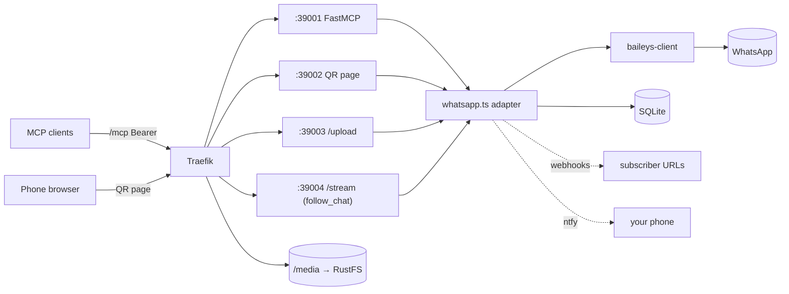

# CLAUDE.md

WhatsApp as an MCP server (FastMCP, 23 tools) on top of Baileys. Production shape: one
long-lived Docker container behind Traefik — MCP at `https://mcp.example.com/mcp` (Bearer
auth), a public QR pairing page at `https://wa.example.com/`, an S3-compatible RustFS sidecar
for media. User-facing overview: [`README.md`](./README.md).

## Setup

Two sibling repos: this one depends on
[`baileys-client`](https://github.com/eusoubrasileiro/baileys-client) via
`link:../baileys-client` (package `@amiticia/baileys-client`). Build the sibling first
(`pnpm install && pnpm build` there), then `pnpm install` here. Without it, typecheck and two
test suites fail on the missing module — not a regression. Node 24 (`.nvmrc`); TypeScript
runs directly via `--experimental-strip-types`, there is no build step.

## Commands

| Command | Does |
|---|---|
| `pnpm start` | Run the server (stdio; `MCP_TRANSPORT=httpstream` for HTTP) |
| `pnpm test` / `pnpm test:coverage` | vitest |
| `pnpm exec tsc --noEmit` | Typecheck |
| `pnpm lint` / `pnpm lint:fix` | Biome |
| `pnpm test:harness` | `node --test` for `scripts/lib/*.test.mjs` |
| `pnpm quality-gate` | Metrics ratchet vs `quality-baseline.json` (fails on regression) |

Husky hooks run tsc + tests + quality gate on every commit, and the full set plus an LLM
security review on push. Never `--no-verify`. Details: [`docs/development.md`](./docs/development.md).

## Architecture



```
src/
├── main.ts            entry; startup order: MCP handshake first, then WhatsApp connect
├── mcp.ts             FastMCP server; registers src/mcp/tools/*.ts
├── mcp/tools/         one file per tool group — thin; logic lives below
├── actions.ts         testable use cases behind the tools
├── whatsapp.ts        adapter over baileys-client: events → DB, sends, media download
├── connection-fsm.ts  connection phases → ntfy pushes (connection-notifier.ts, ntfy.ts)
├── database.ts        Drizzle + better-sqlite3 queries (at the file-size ceiling)
├── db/                schema.ts, ddl.ts (CREATE TABLEs), inbound-history, send-blocklist-store
├── send-*.ts, cold-contact.ts, recipient.ts, ack-*.ts   send guards (see below)
├── env-config.ts      env parsers — malformed value → default, never "guard disabled"
├── media-input.ts, sniffed-media.ts   send_file input resolution + magic-byte MIME sniffing
├── storage.ts         S3/RustFS media plane
├── qr-server.ts, upload-server.ts, http-router.ts   side HTTP servers
├── monitoring.ts, inbound-bus.ts, stream/   reactive monitoring + follow_chat WebSocket
├── webhooks/          outbound inbound-message push (HMAC/Bearer)
├── transcribe/        ffmpeg → FLAC → Whisper via OpenRouter
├── describe/          image description via OpenRouter vision model
└── xml.ts             <transcription> / <image_description> envelopes
```

## Critical rules

- **The send path is guarded; don't weaken it.** Pre-send `onWhatsApp()` check, post-send
  wait for an async rejection ack (~40 ms after "success"), then the anti-ban chain
  blocklist → cold-contact → pacing → typing (order is load-bearing). Read
  [`docs/send-guards.md`](./docs/send-guards.md) and
  [`docs/account-restrictions.md`](./docs/account-restrictions.md) before touching any send
  code or `SEND_*` default — those are risk-owner settings, not tuning knobs.
- **Never hand-build or normalize a JID.** Resolve recipients from contacts. Inserting the
  Brazilian "extra 9" produces a different number. **Never re-send after a 463.**
- **New tables/columns go in `src/db/ddl.ts` and `src/db/schema.ts`** — there is no migration
  runner, and `database.ts` must not grow (quality-gate ceiling).
- **Startup order in `main.ts`**: the MCP handshake completes before Baileys connects;
  reversing it makes stdio clients time out and kill the process.
- **`send_file`'s `file_path` resolves on the server.** Remote clients pass an http(s) URL, a
  `data:` URL, or upload via `POST /upload` first.
- **Audio/vision providers are chosen by env, never by which key is present**
  (`AUDIO_PROVIDER`, `VISION_MODEL`; one `OPENROUTER_API_KEY`).
- Edits to files listed in `scripts/lib/critical-paths.mjs` (guards, data layer, hooks,
  operator scripts, all `*.md`) need human approval.
- Tests first (Red-Green-Refactor); regression test before any bug fix.

## Docs

| Topic | File |
|---|---|
| Every tool, media transcription/description, `/upload` | [`docs/tools.md`](./docs/tools.md) |
| Send guards and error codes (463/479) | [`docs/send-guards.md`](./docs/send-guards.md) |
| Why the anti-ban guards exist, per-instance policy | [`docs/account-restrictions.md`](./docs/account-restrictions.md) |
| `get_new_messages` / `wait_for_messages` / `follow_chat` | [`docs/reactive-monitoring.md`](./docs/reactive-monitoring.md), [`docs/agent-presence-stream-recipe.md`](./docs/agent-presence-stream-recipe.md) |
| Outbound webhooks | [`docs/webhooks.md`](./docs/webhooks.md) |
| Env vars, data layout, DB tables | [`docs/configuration.md`](./docs/configuration.md) |
| Build, pairing, backups, troubleshooting | [`docs/operations.md`](./docs/operations.md) |
| Deploy runbook (Docker + Traefik) | [`deploy/README.md`](./deploy/README.md) |
| Dev setup, tests, hooks, worktrees, probes | [`docs/development.md`](./docs/development.md) |
| Client configs, curl/Python/TS examples | [`examples/`](./examples/) |
